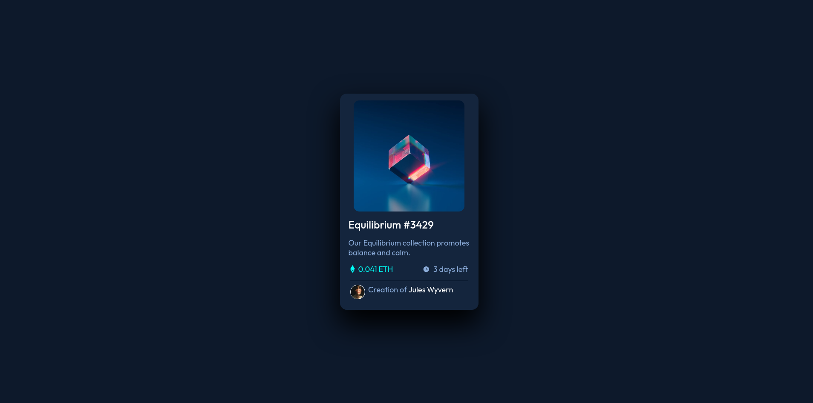

# Frontend Mentor - NFT preview card component solution

This is a solution to the [NFT preview card component challenge on Frontend Mentor](https://www.frontendmentor.io/challenges/nft-preview-card-component-SbdUL_w0U). Frontend Mentor challenges help you improve your coding skills by building realistic projects. 

## Table of contents

- [Overview](#overview)
  - [The challenge](#the-challenge)
  - [Screenshot](#screenshot)
  - [Links](#links)
- [My process](#my-process)
  - [Built with](#built-with)
  - [What I learned](#what-i-learned)
  - [Continued development](#continued-development)
  - [Useful resources](#useful-resources)
- [Author](#author)

## Overview

### The challenge

Users should be able to:

- View the optimal layout depending on their device's screen size
- See hover states for interactive elements

### Screenshot

### Links

- [Solution URL](https://affectionate-bell-19f602.netlify.app/)

## My process

### Built with

- Semantic HTML5 markup
- CSS custom properties
- Flexbox

### What I learned

- Practice with "flex" CSS parameter.
- HSL color picking.

### Continued development

- Will try use "sr-only" property more often.
- Will try to make mobile-oriented layout first.
- Use HSL.

### Useful resources

Nah, I was improvising.

## Author

- [Website](https://affectionate-benz-e7d220.netlify.app/)
- [Frontend Mentor](https://www.frontendmentor.io/profile/yourusername)
